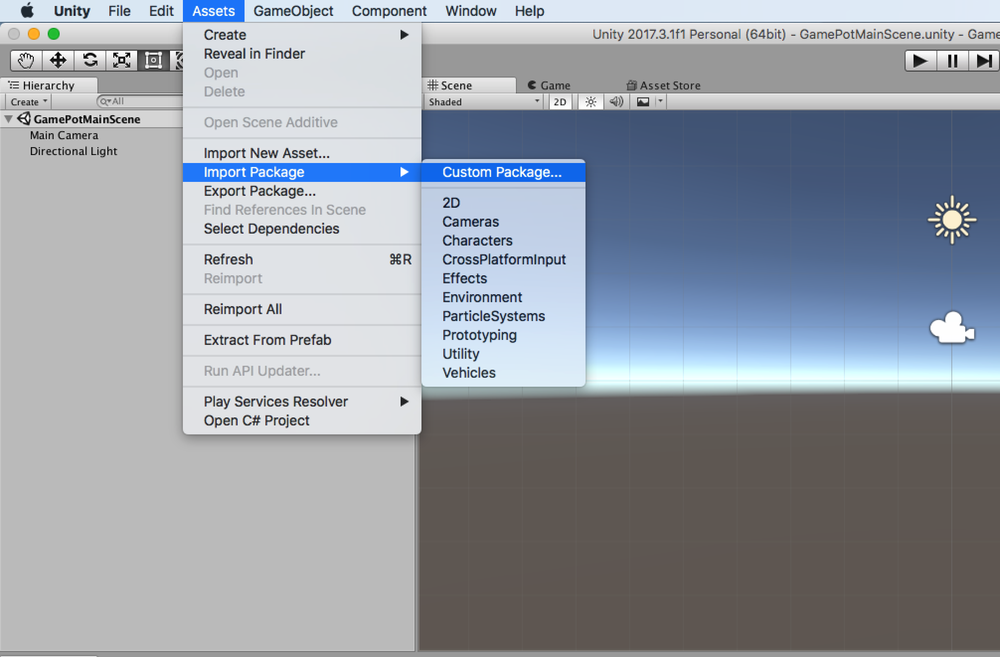
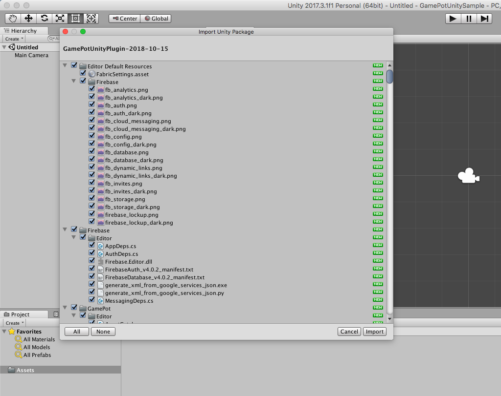
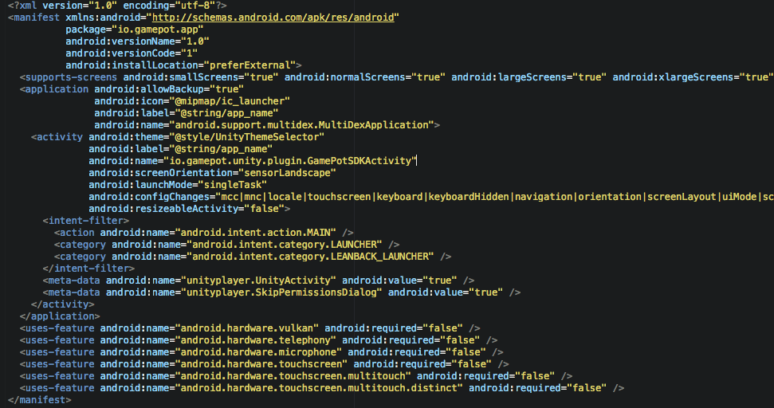
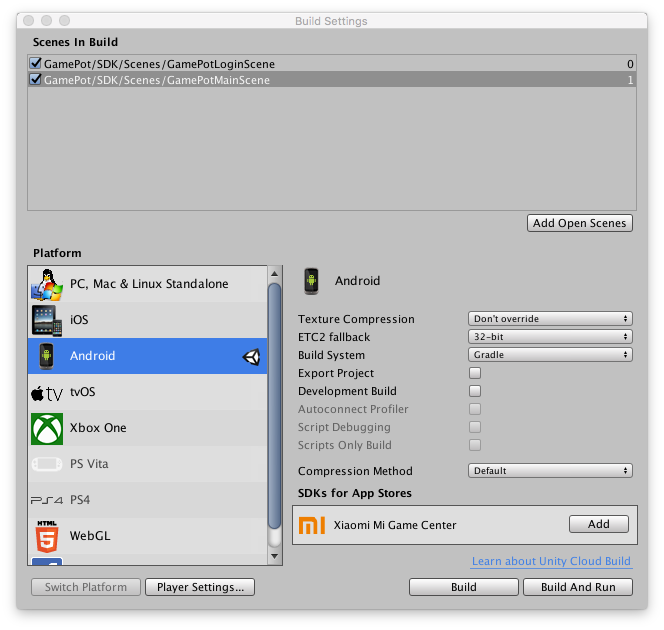
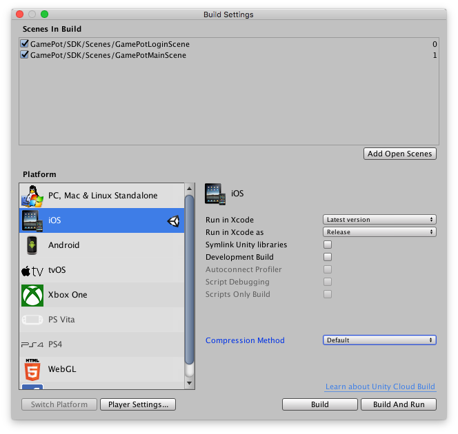
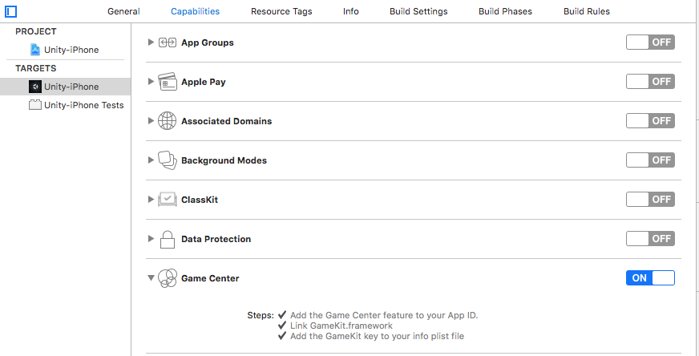

## 개요

네이버 클라우드 게임팟을 편리하게 연동하기 위한 유니티 플러그인을 제공합니다.

## 유니티 플러그인 안내

### 다운로드 

대시보드 공식 다운로드 센터에서 Unity 용 플러그인을 다운로드 하시기 바랍니다. 

## 유니티 플러그인 연동 시작하기


- [시작하기](#시작하기)
- [초기화](#초기화)
- [로그인/로그아웃/탈퇴](#로그인로그아웃탈퇴)
- [계정연동](#계정연동)
  * [구글](#구글)
  * [페이스북](#페이스북)
  * [게임센터](#게임센터)
- [결제](#결제)
- [광고](#광고)
- [푸시](#푸시)
- [쿠폰](#쿠폰)
- [공지사항](#공지사항)
- [문제 해결](#문제 해결)


### 시작하기

#### STEP 1. 게임팟 플러그인 가져오기

생성된 게임팟 콘솔에 접속한 후 최신 플러그인을 다운로드 하시기 바랍니다. 

#### STEP 2. 플러그인 가져오기 

Assets -> Import Package -> Custom Package -> 다운로드 받은 GamePotUnityPlugin-xxxx.unitypackage 파일을 선택해 주세요.



플러그인을 확인 후에 import 하시면 해당 프로젝트 추가 됩니다.




### STEP 3. Android 

Assets/Plugin/Android/AndroidManifest.xml 에서 해당 매개변수를 수정 또는 추가 합니다.



구글 파이어베이스에서 다운로드한 google-services.json 파일을  /Assets/Plugins/Android/ 에 복사 합니다.

File -> Build Settings -> Build System 은 Gradle 로 선택해 주세요.



#### 기본 환경 설정 및 Third Party SDK 추가 방법 

/Assets/Plugin/Android/mainTemplate.gradle 파일을 에디터로 오픈 합니다.

```java
// GENERATED BY UNITY. REMOVE THIS COMMENT TO PREVENT OVERWRITING WHEN EXPORTING AGAIN
buildscript {
	repositories {
		if (GradleVersion.current() >= GradleVersion.version("4.2")) {
            google()
            jcenter()
        } else {
            jcenter()
        }
    }
    dependencies {
		if (GradleVersion.current() < GradleVersion.version("4.0")) {
            classpath 'com.android.tools.build:gradle:2.1.0'
        } else if (GradleVersion.current() < GradleVersion.version("4.2")) {
            classpath 'com.android.tools.build:gradle:2.3.0'
        } else {
            classpath 'com.android.tools.build:gradle:3.0.1'
        }
		classpath 'com.google.gms:google-services:3.2.0'
	}
}

allprojects {
   repositories {
		flatDir {
			dirs 'libs'
		}

		if (GradleVersion.current() >= GradleVersion.version("4.2")) {
            google()
            jcenter()
        } else {
            jcenter()
        }
   }
}

apply plugin: 'com.android.application'

dependencies {
	if (GradleVersion.current() >= GradleVersion.version("4.2")) {
		implementation fileTree(include: ['*.jar'], dir: 'libs')
		implementation project(":GamePotResources")
		implementation project(':Firebase')
	} else {
		compile fileTree(include: ['*.jar'], dir: 'libs')
		compile project(":GamePotResources")
		compile project(':Firebase')
	}
}

fileTree(dir: 'libs', include: ['*.aar'])
        .each { File file ->
    println file.name
	if (GradleVersion.current() >= GradleVersion.version("4.2")) {
		dependencies.add("implementation", [name: file.name.lastIndexOf('.').with { it != -1 ? file.name[0..<it] : file.name }, ext: 'aar'])
	} else {
    	dependencies.add("compile", [name: file.name.lastIndexOf('.').with { it != -1 ? file.name[0..<it] : file.name }, ext: 'aar'])
	}
}

android {
	compileSdkVersion **APIVERSION**
	buildToolsVersion '**BUILDTOOLS**'

	dexOptions {
		javaMaxHeapSize "4g"
	}

	defaultConfig {
		minSdkVersion **MINSDKVERSION**
		targetSdkVersion **TARGETSDKVERSION**
		multiDexEnabled true

		applicationId '**APPLICATIONID**'
        versionCode **VERSIONCODE**
        versionName '**VERSIONNAME**'

        resValue "string", "gamepot_project_id", "" // required
        resValue "string", "gamepot_api_url", "" // required
        resValue "string", "gamepot_store", "google" // required
        resValue "string", "gamepot_app_title","@string/app_name" // required (fcm)
        resValue "string", "gamepot_push_default_channel","Default" // required (fcm)
		resValue "string", "facebook_app_id", "0" // optional (facebook)
		resValue "string", "fb_login_protocol_scheme", "fb0" // optional (facebook)
		// resValue "string", "gamepot_adjust_apptoken","" // optional (adjust)
		// resValue "string", "gamepot_adjust_signature","" // optional (adjust sdk signature)
		// resValue "string", "gamepot_gpg_id","" // optional (google play game)
		// resValue "string", "gamepot_elsa_projectid", "" // optional (ncp elsa)
		// resValue "string", "gamepot_naver_clientid", "" // optional (naver login or naver cafe sdk)
		// resValue "string", "gamepot_naver_secretid", "" // optional (naver login or naver cafe sdk)
		// resValue "integer", "gamepot_naver_cafeid", "0" // optional (naver cafe sdk)
		// resValue "string", "gamepot_naver_global_consumerkey", "" // optional (naver global cafe sdk)
		// resValue "integer", "gamepot_naver_global_cafeid", "0" // optional (naver global cafe sdk)
        // resValue "string", "gamepot_igaworks_app_key", "" // optional (igaworks)
        // resValue "string", "gamepot_igaworks_hash_key", "" // optional (igaworks)
	}

	lintOptions {
		abortOnError false
	}

	aaptOptions {
		noCompress '.unity3d', '.ress', '.resource', '.obb'
	}

	**SIGN**

	buildTypes {
		debug {
			jniDebuggable true
			minifyEnabled false
			**SIGNCONFIG**
		}
		release {
			// Set minifyEnabled to true if you want to run ProGuard on your project
			zipAlignEnabled true
			minifyEnabled false
			proguardFiles getDefaultProguardFile('proguard-android.txt'), 'proguard-unity.txt'
			**SIGNCONFIG**
		}
	}
}
```

사용하고자 하는 Third Party 에 주석을 해제 합니다.

IGAWORKS 사용시 아래 항목을 찾아 주석을 해제 합니다.

```java
// resValue "string", "gamepot_igaworks_app_key", "" // optional (igaworks)
// resValue "string", "gamepot_igaworks_hash_key", "" // optional (igaworks)
```

아래의 필수 값을 찾아 수정합니다. 아래 값들을 수정해야만 정상적으로 작동 됩니다.

```java
resValue "string", "[key]", "[value]"
```

| 값                               | 설명                                                 |
| -------------------------------- | ---------------------------------------------------- |
| gamepot_project_id               | 게임팟에서 발급받은 프로젝트 아이디를 입력해 주세요. |
| gamepot_api_url                  | 게임팟에서 발급받은 API URL을 입력해 주세요.         |
| gamepot_store                    | 스토어값 ( google or one )                           |
| gamepot_app_title                | 앱 제목 (FCM)                                        |
| gamepot_push_default_channel     | 등록된 기본 채널 이름 (Default) - 변경하지 마세요.   |
| facebook_app_id                  | 페이스북 발급 받은 앱ID                              |
| fb_login_protocol_scheme         | 페이스북에서 발급 받은 protocol scheme  fb[app_id]   |
| gamepot_adjust_apptoken          | ADJUST 사용시 발급받은 앱토큰                        |
| gamepot_adjust_signature         | ADJUST 사용시 발급받은 Signature                     |
| gamepot_gpg_id                   | 구글 플레이 게임 사용시 ID                           |
| gamepot_elsa_projectid           | NCLOUD ELSA 사용시 프로젝트ID                        |
| gamepot_naver_clientid           | 네이버 로그인 사용시 발급받은 CLIENT ID              |
| gamepot_naver_secretid           | 네이버 로그인 사용시 발급받은 SECRET ID              |
| gamepot_naver_cafeid             | 네이버 카페 연동시 카페ID                            |
| gamepot_naver_global_consumerkey | 네이버 글로벌 카페 SDK에서 발급받은 Consumer Key     |
| gamepot_naver_global_cafeid      | 네이버 글로벌 카페 SDK에서 발급받은 카페ID           |
| gamepot_igaworks_app_key         | IGAWORKS 사용시 발급받은 앱키                        |
| gamepot_igaworks_hash_key        | IGAWORKS 사용시 발급받은 해시키                      |


#### 푸시 표시 아이콘 변경 방법 


푸시 수신 시 Android Notification bar에 보여질 small icon은 SDK내부에서 기본 이미지로 노출을 하며 직접 추가하실수도 있습니다.

직접 넣으려면 drawable 폴더 별로 이미지를 넣어야 합니다. ([링크](http://romannurik.github.io/AndroidAssetStudio/icons-notification.html#source.type=clipart&source.clipart=ac_unit&source.space.trim=1&source.space.pad=0&name=ic_stat_gamepot_small))를 통해 제작하면 자동으로 폴더 별로 이미지가 제작되어 편리합니다.)

이미지 파일명은 ic_stat_gamepot_small 이어야 합니다.

| 폴더명                | 크기  |
| --------------------- | ----- |
| res/drawable-mdpi/    | 24x24 |
| res/drawable-hdpi/    | 36x36 |
| res/drawable-xhdpi/   | 48x48 |
| res/drawable-xxhdpi/  | 72x72 |
| res/drawable-xxxhdpi/ | 96x96 |


### STEP 4. iOS

구글 파이어베이스에서 다운로드한 GamePotConfig-Info.plist 파일을  /Assets/Plugins/IOS/ 에 복사 합니다.

/Assets/Plugin/GamePotConfig-Info.plist 내에 필요한 환경 변수를 추가해 주세요.


|                                  | 설명                                                 |
| -------------------------------- | ---------------------------------------------------- |
| gamepot_project_id               | 게임팟에서 발급받은 프로젝트 아이디를 입력해 주세요. |
| gamepot_store                    | 스토어값 ( google or apple or one )                  |
| gamepot_app_title                | 앱 제목 (FCM)                                        |
| gamepot_facebook_app_id          | 페이스북 발급 받은 앱ID                              |
| gamepot_facebook_display_name    | 페이스북에 보여지는 이름                             |
| gamepot_adjust_id                | ADJUST 사용시 발급받은 앱토큰                        |
| gamepot_adjust_signature         | ADJUST 사용시 발급받은 Signature                     |
| gamepot_google_app_id		   | GoogleService-Info 파일의 CLIENT_ID 값             |
| gamepot_google_url_schemes       | GoogleService-Info 파일의 REVERSED_CLIENT_ID 값  |
| gamepot_elsa_projectid           | NCLOUD ELSA 사용시 프로젝트ID                        |
| gamepot_naver_clientid           | 네이버 로그인 사용시 발급받은 CLIENT ID              |
| gamepot_naver_secretid           | 네이버 로그인 사용시 발급받은 SECRET ID              |
| gamepot_naver_cafeid             | 네이버 카페 연동시 카페ID                            |
| gamepot_naver_global_consumerkey | 네이버 글로벌 카페 SDK                               |
| gamepot_naver_global_cafeid      | 네이버 글로벌 카페 SDK                               |
| gamepot_igaworks_appid           | IGAWORKS 사용시 발급받은 앱키                        |
| gamepot_igaworks_hashkey         | IGAWORKS 사용시 발급받은 해시키                      |

scenes 을 추가하신 후에 

File -> Build Settings -> Build And Run 하시면 완료 됩니다.




### 초기화

게임을 시작할때 로드 되는 첫 장면에 사용되는 개체에 다음 코드를 추가합니다. 

```c#
using GamePotUnity;
public class GamePotLoginSampleScene : MonoBehaviour {
    void Awake() {
        GamePot.initPlugin();  
    }
    void Start () {
        GamePot.setListener(  GamePotInterface.cs 상속받은 class );  
         // ex) GamePot.setListener(new GamePotSampleListener());
    }

}

ex)
public class GamePotSampleListener : MonoBehaviour , NSDKInterface {
    ....
}
```


### 오류코드

```c#
public class NError
{
    //Detail Error code
    public static readonly int CODE_UNKNOWN_ERROR           = 0;                    // 알 수 없는 Error
    public static readonly int CODE_NOT_INITALIZE           = 1;                    // 초기화 실패
    public static readonly int CODE_INVAILD_PARAM           = 2;                    // 파라미터가 올바르지 않은 경우
    public static readonly int CODE_MEMBERID_IS_EMPTY       = 3;                    // 멤버아이디 데이터가 없을때
    public static readonly int CODE_NOT_SIGNIN              = 4;                    // 로그인이 되지 않은 상태
    public static readonly int CODE_NETWORK_MODULE_NOT_INIT = 3000;                 // 네트웍 모듈이 초기화 되지 않았을 때
    public static readonly int CODE_NETWORK_ERROR           = 3001;                 // 네트웍 연결 오류 및 타임아웃 발생 시
    public static readonly int CODE_SERVER_ERROR            = 4000;                 // server-side에서 발생하는 오류
    public static readonly int CODE_SERVER_HTTP_ERROR       = 4001;                 // http response code가 성공이 아닌 경우
    public static readonly int CODE_SERVER_NETWORK_ERROR    = 4002;                 // 네트웍 연결 오류 및 타임아웃 발생 시
    public static readonly int CODE_SERVER_PARSING_ERROR    = 4003;                 // 서버에서 받은 데이터를 파싱할때 오류
    public static readonly int CODE_CHARGE_UNKNOWN_ERROR    = 5000;                 // 결제에서 알 수 없는 오류 발생 및 스토어 측에서 Error를 전달 할 때
    public static readonly int CODE_CHARGE_PRODUCTID_EMPTY  = 5001;                 // product id를 넣지 않은 경우
    public static readonly int CODE_CHARGE_PRODUCTID_WRONG  = 5002;                 // product id를 잘못 넣은 경우
    public static readonly int CODE_CHARGE_CONSUME_ERROR    = 5003;                 // consume시 오류


    public int code { get; set; }                                                      // error Code
    public string message { get; set; }                                             // error Message
}   
```


### 로그인/로그아웃/탈퇴

#### 로그인

별도의 가입 없이 신규 가입가 일 경우에는 사용자 계정이 생성 됩니다. 모든 신원 확인을 위한 MemberId 가 생성되며, 생성된 정보는 NUserInfo 구조체에 저장되어 리턴합니다.

Request:

```c#
GamePot.login(NCommon.LoginType);
```

Response:

```c#
// 로그인 성공
public void onLoginSuccess(NUserInfo userInfo)
{
} 
// 로그인 실패
public void onLoginFailure(NError error)
{
	// 로그인을 실패하는 경우
	// error.message를 팝업 등으로 유저에게 알려주세요.
}
// 로그인 취소
public void onLoginCancel()
{
	// 사용자가 임의로 로그인을 취소한 경우
}
// 강제 업데이트(스토어 버전과 클라이언트 버전이 다를 경우 호출)
public void onNeedUpdate(NAppStatus status)
{
	// TODO : 파라미터로 넘어온 status정보를 토대로 팝업을 만들어 사용자에게 알려줘야 합니다.
	// TODO : 아래 두 가지 방식 중 한가지를 선택하세요.
    // case 1 : 인게임 팝업을 통해 개발사에서 직접 UI 구현
    // case 2 : SDK의 팝업을 사용 (이 경우에는 아래 코드를 호출 해주세요.)
    // GamePot.showAppStatusPopup(status.ToJson());
}
// 점검(대시보드에 점검이 활성화 되어있는 경우 호출)
public void onMainternance(NAppStatus status)
{
   	// TODO : 파라미터로 넘어온 status정보를 토대로 팝업을 만들어 사용자에게 알려줘야 합니다.
	// TODO : 아래 두 가지 방식 중 한가지를 선택하세요.
    // case 1 : 인게임 팝업을 통해 개발사에서 직접 UI 구현
    // case 2 : SDK의 팝업을 사용 (이 경우에는 아래 코드를 호출 해주세요.)
    // GamePot.showAppStatusPopup(status.ToJson());
}
// 앱 종료
public void onAppClose()
{
    // TODO: 강제 업데이트나 점검 기능을 case2 방식으로 구현하는 경우
    // TODO: 앱을 강제 종료할 수 있기 때문에 이 곳에 앱을 종료할 수 있도록 구현하세요.
}
```

LoginType 정의 

```C#
public enum LoginType
{
     NONE,
     GOOGLE,  
     GOOGLEPLAY,
     FACEBOOK,
     NAVER,
     GAMECENTER,
     GUEST
}

```

NUserInfo 정의

```c#
public class NUserInfo
{
 
    public string id { get; set; }              // 맴버ID
    public string name { get; set; }            // 이름
    public string profileUrl { get; set; }      // 프로필URL (존재시)
    public string email { get; set; }           // 이메일 (존재시)
    public string token { get; set; }           // Token
    public string socialid { get; set; }        // Social ID(google, facebook ...)
}  
```


로그인 정보 가져오기

```c#
GamePot.getMemberId();   		// 맴버ID
GamePot.getMemberName(); 		// 맴버이름   
GamePot.getMemberSocialId();    // 소셜ID
```
#### 자동 로그인
```c#
NCommon.LoginType type = GamePot.getLastLoginType();
if(type != NCommon.LoginType.NONE) {
{
    // 마지막에 로그인 했던 로그인 타입으로 로그인 하는 방식입니다.
    GamePot.login(type);
}
else
{
    // 처음 게임을 실행했거나 로그아웃한 상태. 로그인을 할 수 있는 로그인 화면으로 이동해주세요.
}
```

#### 로그아웃

사용자를 로그아웃 합니다. 계정이 삭제되지 않으며, 동일한 계정으로 로그인이 가능합니다.

Request:

```
GamePot.logout();
```

Response:

```
/// 로그아웃 성공
public void onLogoutSuccess()
{
}
 
/// 로그아웃 실패
public void onLogoutFailure(NError error)
{
}
```


#### 탈퇴

회원을 탈퇴하며, 복구가 불가능 합니다.

Request:

```
GamePot.deleteMember();
```

Response:

```
/// 회원 탈퇴 성공
public void onDeleteMemberSuccess() {
}
 
/// 회원 탈퇴 실패
public void  onDeleteMemberFailure(NError error) {
}
```


### 계정연동

구글 / 페이스북 / 게임센터등의 아이디와 현재 계정을 연동할 수 있습니다. 

```c#
public enum LinkingType
{
      GOOGLEPLAY,
      GAMECENTER,
      GOOGLE,
      FACEBOOK,
      NAVER
}
```

계정 연동을 진행합니다.

Request:

```c#
GamePot.createLinking(NCommon.LinkingType.XXXXX);
```

Response:

```C#
/// 계정 연동 취소
public void onCreateLinkingCancel() {
}
 
/// 계정 연동 성공
public void onCreateLinkingSuccess(NUserInfo userInfo) {
}
 
/// 계정 연동 실패
public void onCreateLinkingFailure(NError error) {
}
```


현재 연동된 모든 계정 정보를 가져올 수 있습니다.

```C#
NLinkingInfo[] GamePot.getLinkedList();
```

링크 정보 정의

```c#
public class NLinkingInfo
{
    public LinkingType provider { get; set; }  // google, facebook, naver
}
```


계정 연동 해제

Request : 

```
void GamePot.deleteLinking(NCommon.LinkType.XXXXX);
```

Response:

```
/// 계정 연동 해제 성공
public void onDeleteLinkingSuccess() {
}
 
/// 계정 연동 해제 실패
public void onDeleteLinkingFailure(NError error) {
}
```


#### 구글

##### Android

구글 파이버베이스 콘솔에서 Android 용 google-service.json 을 다운로드 하신 후에 

/Assets/Plugins/Android/ 에 복사 합니다.

mainTemplate.gradle

```java
dependencies {
    compile(name: 'gamepot-channel-google-signin', ext: 'aar')
    compile 'com.google.android.gms:play-services-auth:15.0.1'
}
```

##### iOS

구글 파이버베이스 콘솔에서 iOS 용 GoogleService-Info.plist 을 다운로드 하신 후에

/Assets/Plugins/IOS/ 에 복사 합니다.


#### 페이스북

페이스북 개발자 페이지에서 앱 정보를 등록합니다. 등록 후 페이스북 앱 ID 를  확인 합니다.

##### Android

mainTemplate.gradle 에 아래 항목을 추가 하거나 주석을 해제 합니다.

```java
dependencies {
	compile(name: 'gamepot-ad-facebook', ext: 'aar')
	compile 'com.facebook.android:facebook-android-sdk:[4,5)'
    compile(name: 'gamepot-channel-facebook', ext: 'aar')
}	
...
    
defaultConfig {
	resValue "string", "facebook_app_id", "" // optional (facebook)
	resValue "string", "fb_login_protocol_scheme", ""
}
...
```

페이스북 개발자 센터에서 발급 받은 facebook_app_id 에 추가하고 fb[facebook_app_id] 를 입력해 주세요. 

예) app_id 가 123456789 인 경우 fb123456789 이 fb_login_protocol_scheme 입니다.

##### iOS

/Assets/Plugins/IOS/Frameworks 에 아래 프레임 워크를 추가 합니다.

FBSDKLoginKit.framework
FBSDKCoreKit.framework
Bolts.framework
NFacebookChannel.framework


#### 게임센터

iOS 만 해당하는 기능 입니다.

/Assets/Plugins/IOS/Frameworks/ 에 Gamekit.framwork 를 복사합니다. General -> Linked Frameworks and Libraries 내에 복사한 프레임워크를 추가 합니다.

Capabilities 설정에서 Game Center ON 설정합니다. ( 앱스토어 콘솔에서도 Game Center ON 설정 되어 있어야 합니다.)




### 결제

#### 인앱 상품 조회

스토어에서 제공하는 상품정보를 가져와 화면에 표시해 주세요. 구각에 따라 통화, 설명등이 다르게 표시됩니다.

```c#
NPurchaseItem[] GamePot.getPurchaseItems();
foreach(NPurchaseItem item in GamePot.getPurchaseItems()) {
    Debug.Log(item.productId);		// 상품ID
    Debug.Log(item.price);			// 가격
    Debug.Log(item.title);			// 제목
    Debug.Log(item.description);	// 설명
}
```


### 인앱 상품 결제

아래 함수 하나로 구글, 애플, 앱스토어 결제가 가능합니다.

Request:

```c#
// productId : 마켓에 등록된 상품ID
GamePot.purchase(string productId)
```

Response:

```c#
/// 인앱 결제 성공
public void onPurchaseSuccess(PurchaseInfo purchase) {
}
 
/// 인앱 결제 실패
public void onPurchaseFailure(NError error) {
}
 
/// 인앱 결제 실패
public void onPurchaseCancel() {
}
```


### 광고

게임팟에는 다양한 광고 Third Party 연동 방법을 안내 합니다. 사용하자하는 광고 를 아래와 같이 추가합니다.

```c#
public enum AdType 
{
    FACEBOOK,
    ADJUST,
    ADBRIX
}
```

사용할 광고를 추가합니다.

```c#
GamePot.addAd(NCommon.AdType.XXXX);
```

SandBox 모드 활성화

```c#
GamePot.setSandbox(bool enable);
```

이벤트 트래킹 전송

```C#
// 튜토리얼 완료
TutorialInfo tutorialInfo = new TutorialInfo("튜토리얼 완료", "1", true);
GamePot.tracking(NSDKCommon.NAdActions.TUTORIAL_COMPLETE, trackingInfo);
 
// 레벨별 달성 
LevelInfo levelInfo = new LevelInfo("12"); // 레벨 값
GamePot.tracking(NSDKCommon.NAdActions.LEVEL, levelInfo); // 레벨 Tracking
 
// 이벤트 완료
EventInfo eventInfo = new EventInfo("test");
GamePot.Tracking(NSDKCommon.NAdActions.EVENT, eventInfo);
```


##### ADJUST 의 경우 아래와 같이 이용해 주세요.

```c#
GamePot.setAdjustData(AdjustInfo adjustDatas) // Adjust 사용 시 필수.
 
 
ex)
List<AdjustBillingData> adjustList = new List<AdjustBillingData>();
AdjustInfo adjustList.Add(new AdjustBillingData("test1 productId", "AOS adjust key1"));
adjustList.Add(new AdjustBillingData("test2 productId", "AOS adjust key2"));
adjustInfo = new AdjustInfo(adjustList);
GamePot.setAdjustData(adjustInfo);
```


### 푸시

#### 푸시 설정

Request:

```c#
GamePot.setPush(bool pushEnable);
```

Response:

```c#
/// 푸시 상태 변경에 대한 서버 통신 성공
public void setPushSuccess() {
}
 
/// 푸시 상태 변경에 대한 서버 통신 실패
public void setPushFailure(NError error) {
}
```

#### 야간 푸시 설정

Request:

```c#
GamePot.setPushNight(bool nightPushEnable);
```

Response:

```c#
/// 야간 푸시 상태 변경에 대한 서버 통신 성공
public void setPushNightSuccess() {
}
 
/// 야간 푸시 상태 변경에 대한 서버 통신 실패
public void setPushFailure(NError error) {
}
```


#### 푸시 상태 조회

```
NPushInfo pushInfo = GamePot.getPushStatus();
// pushInfo.enable  푸시 허용 여부
// pushInfo.night   야간 푸시 동의 여부
```


### 쿠폰

#### 쿠폰 사용 조회

Request:

```c#
GamePot.Coupon(string couponNumber); // 쿠폰번호
```

Response:

```c#
/// 쿠폰 사용 성공
public void onCouponSuccess() {
}
 
/// 쿠폰 사용 실패
public void onCouponFailure(NError error) {
}
```

### 공지사항

```c#
GamePot.showNoticeWebView();
```

### 고객센터

```c#
GamePot.showCSWebView();
```


### 문제 해결

#### 

